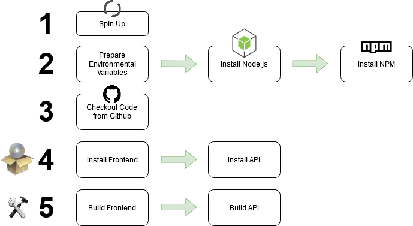

# Infrastructure

## Amazon Web Services
The front end, API and database are all hosted on AWS:

* Front End = S3 Bucket (because it is a static site)
* API = Elastic Beanstalk (because it is dynamic)
* PostgreSQL database = Amazon RDS

## Deployment Pipeline
The apps and database are deployed using [this CircleCI Pipeline](https://app.circleci.com/pipelines/github/mikejpoole/nd0067-c4-udagram/) which has the following flow:

